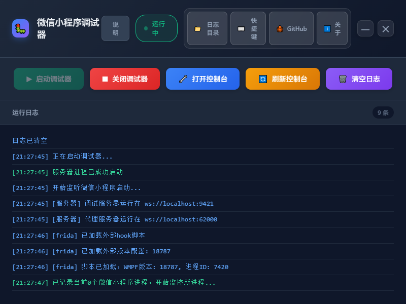

# WMPFDebugger - 微信小程序自动调试工具

[](https://github.com/SuperNaiBA/WMPFDebugger-auto/stargazers)
[](https://github.com/SuperNaiBA/WMPFDebugger-auto/issues)
[](LICENSE)
[](https://www.electronjs.org/)
[](https://nodejs.org/)
[](https://github.com/SuperNaiBA/WMPFDebugger-auto)

**WMPFDebugger** 是一个现代化的微信小程序桌面调试工具，支持自动检测微信小程序启动并立即打开控制台进行调试「最新重构版」。

## ✨ 功能特性

### 🚀 核心功能
- **自动检测** - 实时监控微信小程序进程（每3秒检测一次）
- **智能识别** - 只对调试器启动后新开的小程序生效
- **0秒响应** - 检测到新小程序后立即打开控制台
- **重复检测** - 控制台关闭后可再次自动打开新的小程序

### 🎨 现代化界面
- **深色主题** - 护眼舒适的现代化深色界面
- **无边框设计** - 移除默认菜单栏，自定义窗口控制
- **玻璃态效果** - 导航栏采用毛玻璃背景效果
- **响应式布局** - 完美适配不同屏幕尺寸

### 🛠️ 实用工具
- **一键操作** - 启动/停止调试器、打开/刷新控制台
- **实时日志** - 完整的运行日志显示，支持清空
- **快捷键支持** - 提供完整的快捷键操作
- **快速访问** - 直接打开项目目录和GitHub仓库

## 📸 界面预览



## 🚦 快速开始

### 环境要求
- **Node.js**  LTS v22 或更高版本
- **npm** 或 **yarn**
- **微信桌面版** 已安装
- **Windows 10/11**（目前仅支持Windows）

### 安装步骤

1. **克隆仓库**
   ```bash
   git clone https://github.com/SuperNaiBA/WMPFDebugger-auto.git
   cd WMPFDebugger-auto
   ```

2. **安装依赖**
   ```bash
   npm install
   ```

3. **编译项目**
   ```bash
   npm run build
   ```

4. **启动应用**
   ```bash
   npm run ui
   ```
   或直接双击 `start-app.bat`

### 使用方法

1. **启动调试器** - 点击"启动调试器"按钮
2. **打开微信** - 启动微信并打开小程序
3. **自动调试** - 系统会自动检测并打开控制台
4. **开始调试** - 在控制台中进行小程序调试

## 🎯 详细使用说明

### 基本操作流程

1. **首次启动**
   ```
   启动调试器 → 打开微信 → 启动小程序 → 自动打开控制台
   ```

2. **重复使用**
   - 关闭控制台窗口后，再次打开新小程序会自动重新打开控制台
   - 支持多小程序自动识别和切换

### 功能按钮说明

| 按钮 | 功能 | 快捷键 |
|------|------|--------|
| ▶ 启动调试器 | 启动后端调试服务 | Ctrl+Q |
| ■ 关闭调试器 | 停止后端调试服务 | Ctrl+W |
| 🔧 打开控制台 | 手动打开调试控制台 | Ctrl+D |
| 🔄 刷新控制台 | 刷新调试控制台页面 | Ctrl+R |
| 🗑️ 清空日志 | 清空运行日志区域 | Ctrl+L |
| 📁 日志目录 | 打开项目文件夹 | - |
| ⌨️ 快捷键 | 显示快捷键帮助 | - |
| 🐙 GitHub | 打开项目GitHub仓库 | - |
| ℹ️ 关于 | 显示应用信息 | - |

### 状态指示

- **🔴 未运行** - 调试器未启动
- **🟢 运行中** - 调试器正在运行，等待小程序启动
- **🟡 已连接** - 检测到小程序并已连接

## 🏗️ 项目结构

```
WMPFDebugger/
├── src/                    # TypeScript源代码
│   ├── index.ts           # 主服务器逻辑
│   └── third-party/       # 第三方库适配
├── UI/                    # 用户界面
│   ├── app.html          # 主界面HTML
│   ├── main.js           # Electron主进程
│   └── screenshots/      # 截图目录
├── dist/                  # 编译后的JavaScript
├── frida/                 # Frida脚本
├── screenshots/           # 项目截图
├── package.json          # 项目配置
├── tsconfig.json         # TypeScript配置
├── start-app.bat         # Windows启动脚本
├── README-QQ-Farm.md         # QQ农场项目
└── README.md            # 项目说明
```

## 🔧 技术栈

- **前端**: Electron + HTML/CSS/JavaScript
- **后端**: Node.js + TypeScript
- **调试**: Chrome DevTools Protocol
- **进程监控**: Windows WMIC
- **构建**: TypeScript Compiler

## 📱 主要特性详解

### 智能进程监控
- 使用WMIC命令实时监控微信进程
- 智能过滤已存在的进程，只检测新启动的小程序
- 精确识别小程序进程参数

### 自动控制台管理
- 自动打开Chrome DevTools控制台
- 支持控制台刷新和重新连接
- 优雅的错误处理和重试机制

### 现代化用户界面
- 完全自定义的Electron窗口
- 现代化的深色主题设计
- 响应式布局适配不同分辨率
- 完整的键盘快捷键支持

## 🚀 开发指南

### 环境搭建
```bash
# 安装开发依赖
npm install

# 开发模式编译
npm run build

# 启动开发环境
npm run ui
```

### 构建发布
```bash
# 打包Windows应用
npm run package-win

# 构建可执行文件
npm run package
```

### 代码结构
- **src/index.ts** - 核心调试服务器逻辑
- **UI/main.js** - Electron主进程
- **UI/app.html** - 用户界面和交互逻辑

## 📄 许可证

本项目采用 **GPL-2.0** 许可证 - 查看 [LICENSE](LICENSE) 文件了解详情。

## 🤝 贡献指南

欢迎提交Issue和Pull Request！

1. Fork 本仓库
2. 创建功能分支 (`git checkout -b feature/AmazingFeature`)
3. 提交更改 (`git commit -m 'Add some AmazingFeature'`)
4. 推送到分支 (`git push origin feature/AmazingFeature`)
5. 开启一个 Pull Request

## 📞 联系与支持

- **GitHub Issues**: [问题反馈](https://github.com/SuperNaiBA/WMPFDebugger-auto/issues)
- **作者**: SuperNaiBA
- **项目地址**: https://github.com/SuperNaiBA/WMPFDebugger-auto

## 🙏 致谢
- 原始项目：[evi0s/WMPFDebugger](https://github.com/evi0s/WMPFDebugger)
- 二次修改基础：[gugugudo/WMPFDebugger](https://github.com/gugugudo/WMPFDebugger)
- 所有为本项目提供反馈与贡献的开发者
- 感谢所有贡献者和用户
- 感谢开源社区提供的优秀工具
- 特别感谢微信小程序开发社区

---

**提示**: 使用前请确保已安装微信桌面版，并且有可调试的小程序。启动调试器后，请打开微信并启动小程序进行调试。
## Star History

<a href="https://star-history.com/#SuperNaiBA/WMPFDebugger-auto&Date">
  <picture>
    <source media="(prefers-color-scheme: dark)" srcset="https://api.star-history.com/svg?repos=SuperNaiBA/WMPFDebugger-auto&type=Date&theme=dark">
    <source media="(prefers-color-scheme: light)" srcset="https://api.star-history.com/svg?repos=SuperNaiBA/WMPFDebugger-auto&type=Date">
    
  </picture>
</a>